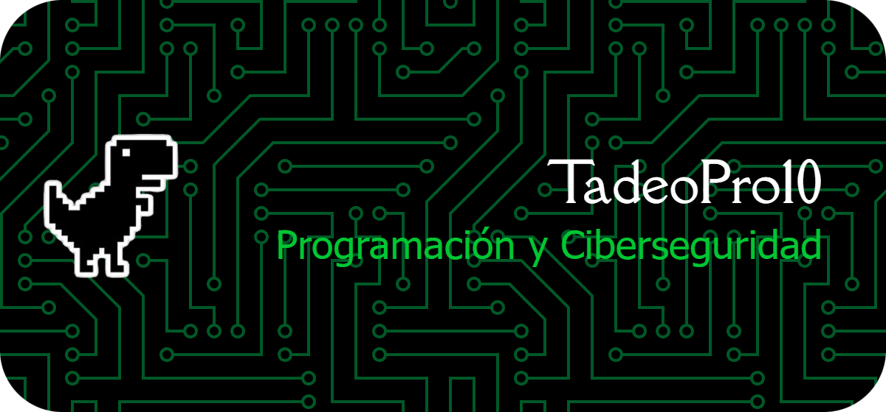

#  Bienvenido al GitHub de TadeoPro10

!Hola! Soy un apasionado de la ingeniería de software y la ciberseguridad. En este espacio comparto proyectos enfocados en el desarrollo de aplicaciones seguras, administración de servidores y proyectos sobre la utilización básica de Python y JavaScript.

Me encanta explorar nuevas tecnologías y transformar ideas en codigo eficiente y funcional. !Te invito a explorar mis repositorios! Si ves algo que te interese, no dudes en contactarme.

### Skills

  
  
  

